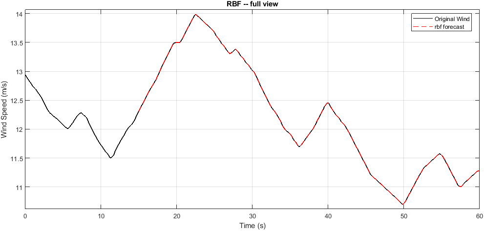
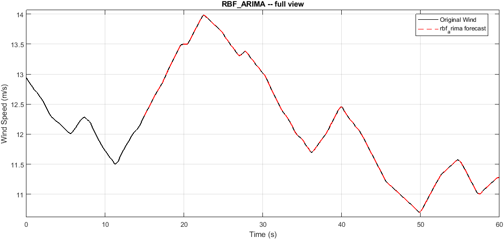
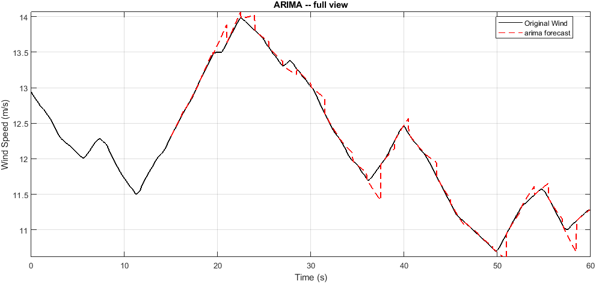

# wind profile 02

Wind prediction benchmark. Generated automatically -- do not edit by hand.

## Run settings

| Parameter | Value |
|---|---|
| History window | 15.00 s |
| Forecast horizon | 1.50 s |
| Stride | 1.50 s |
| Segments | 30 |
| Wind range | 10.70 to 13.98 m/s |
| Selection criterion | RMSE |

## Model ranking

| Rank | Model | RMSE | nRMSE | MAE | MAPE % | sMAPE % | R2 | DM p | Time (s) |
|---:|---|---:|---:|---:|---:|---:|---:|---:|---:|
| 1 | `rbf` | 0.0010 | 0.0003 | 0.0009 | 0.01 | 0.01 | 0.9996 | 1.0000 | 0.01 |
| 2 | `rbf_arima` | 0.0010 | 0.0003 | 0.0009 | 0.01 | 0.01 | 0.9996 | NaN | 0.07 |
| 3 | `arima` | 0.0671 | 0.0205 | 0.0528 | 0.44 | 0.44 | -2.7192 | 0.0039 | 0.25 |

## Per-model forecasts

### RBF (rank 1, RMSE 0.0010)

### RBF_ARIMA (rank 2, RMSE 0.0010)

### ARIMA (rank 3, RMSE 0.0671)

## Artifacts

- `report/prediction_suite_report.txt` -- full written report
- `report/prediction_suite_summary.json` -- machine-readable summary
- `report/*.csv` -- metrics as CSV (GitHub renders these as tables)
- `summary_table.tex` -- LaTeX table for the thesis
- `prediction/figures/`, `prediction/animation/` -- full-resolution assets
- `prediction/web/` -- downscaled assets used by report.html
- `prediction_suite_results.mat` -- raw numbers behind all of the above
