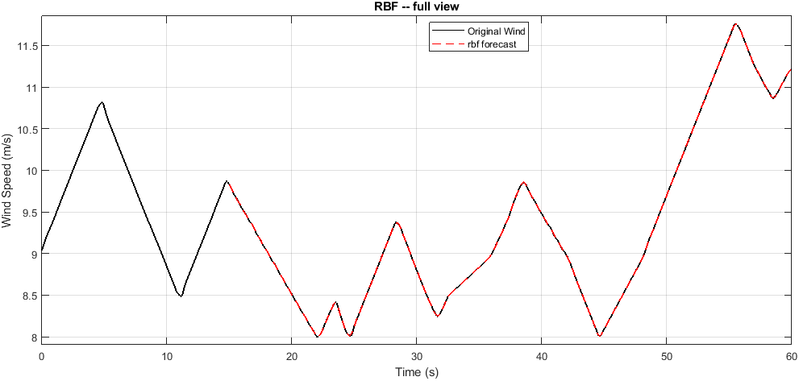
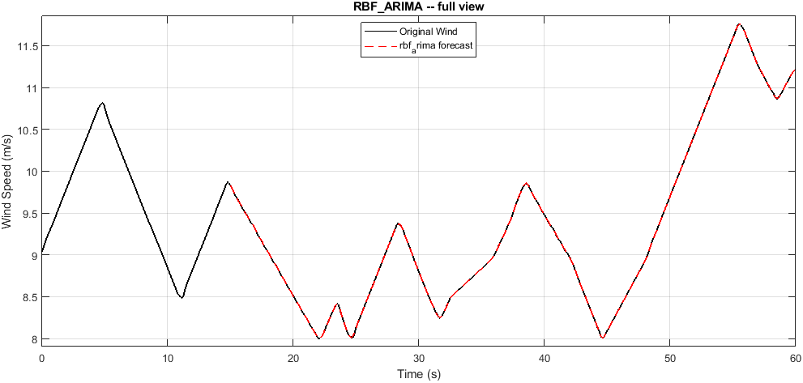
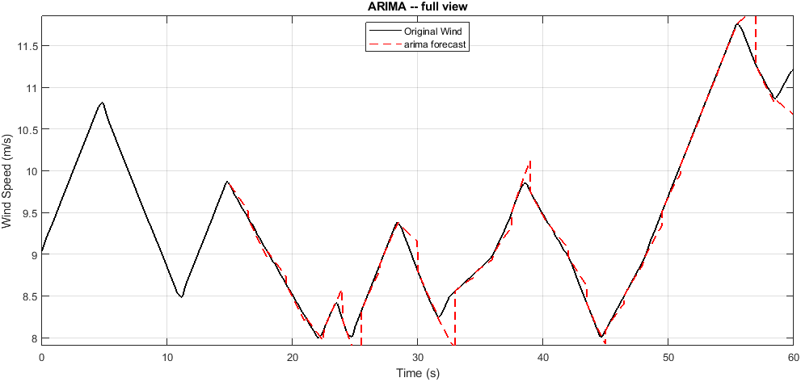

# wind profile 03

Wind prediction benchmark. Generated automatically -- do not edit by hand.

## Run settings

| Parameter | Value |
|---|---|
| History window | 15.00 s |
| Forecast horizon | 1.50 s |
| Stride | 1.50 s |
| Segments | 30 |
| Wind range | 8.00 to 11.76 m/s |
| Selection criterion | RMSE |

## Model ranking

| Rank | Model | RMSE | nRMSE | MAE | MAPE % | sMAPE % | R2 | DM p | Time (s) |
|---:|---|---:|---:|---:|---:|---:|---:|---:|---:|
| 1 | `rbf` | 0.0025 | 0.0007 | 0.0020 | 0.02 | 0.02 | 0.9993 | 1.0000 | 0.01 |
| 2 | `rbf_arima` | 0.0025 | 0.0007 | 0.0020 | 0.02 | 0.02 | 0.9993 | NaN | 0.07 |
| 3 | `arima` | 0.0923 | 0.0246 | 0.0725 | 0.78 | 0.78 | -0.5960 | 0.0094 | 0.27 |

## Per-model forecasts

### RBF (rank 1, RMSE 0.0025)

### RBF_ARIMA (rank 2, RMSE 0.0025)

### ARIMA (rank 3, RMSE 0.0923)

## Artifacts

- `report/prediction_suite_report.txt` -- full written report
- `report/prediction_suite_summary.json` -- machine-readable summary
- `report/*.csv` -- metrics as CSV (GitHub renders these as tables)
- `summary_table.tex` -- LaTeX table for the thesis
- `prediction/figures/`, `prediction/animation/` -- full-resolution assets
- `prediction/web/` -- downscaled assets used by report.html
- `prediction_suite_results.mat` -- raw numbers behind all of the above
