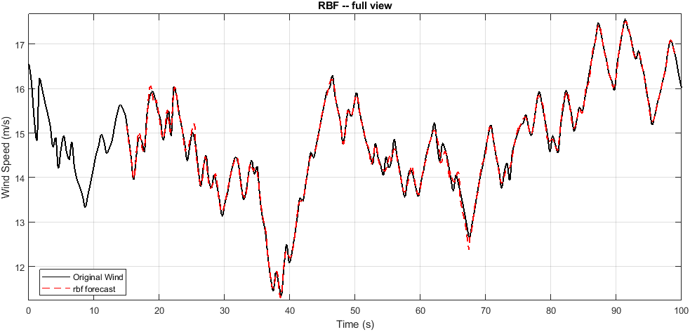
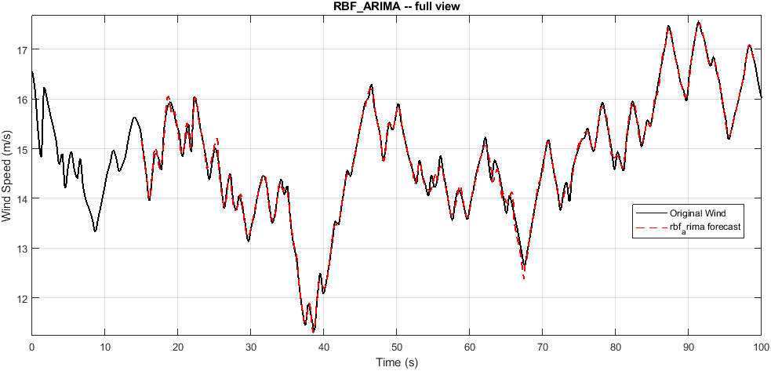
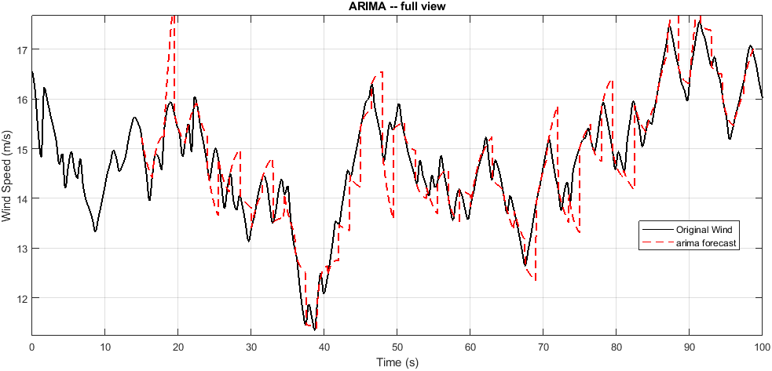

# wind profile 07

Wind prediction benchmark. Generated automatically -- do not edit by hand.

## Run settings

| Parameter | Value |
|---|---|
| History window | 15.00 s |
| Forecast horizon | 1.50 s |
| Stride | 1.50 s |
| Segments | 56 |
| Wind range | 11.35 to 17.56 m/s |
| Selection criterion | RMSE |

## Model ranking

| Rank | Model | RMSE | nRMSE | MAE | MAPE % | sMAPE % | R2 | DM p | Time (s) |
|---:|---|---:|---:|---:|---:|---:|---:|---:|---:|
| 1 | `rbf` | 0.0705 | 0.0114 | 0.0599 | 0.41 | 0.41 | 0.8121 | 1.0000 | 0.01 |
| 2 | `rbf_arima` | 0.0705 | 0.0114 | 0.0599 | 0.41 | 0.41 | 0.8121 | NaN | 0.08 |
| 3 | `arima` | 0.4552 | 0.0733 | 0.3745 | 2.55 | 2.56 | -3.4113 | 0.0000 | 0.26 |

## Per-model forecasts

### RBF (rank 1, RMSE 0.0705)

### RBF_ARIMA (rank 2, RMSE 0.0705)

### ARIMA (rank 3, RMSE 0.4552)

## Artifacts

- `report/prediction_suite_report.txt` -- full written report
- `report/prediction_suite_summary.json` -- machine-readable summary
- `report/*.csv` -- metrics as CSV (GitHub renders these as tables)
- `summary_table.tex` -- LaTeX table for the thesis
- `prediction/figures/`, `prediction/animation/` -- full-resolution assets
- `prediction/web/` -- downscaled assets used by report.html
- `prediction_suite_results.mat` -- raw numbers behind all of the above
